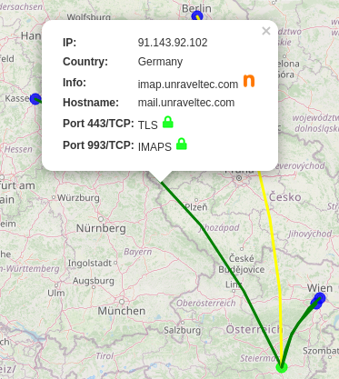

# IoT-Watchdog Anleitung

Das Projekt IoT-Watchdog wurde im Rahmen der [Netidee 2019](https://www.netidee.at/iot-watchdog) gestartet.

Der IoT-Watchdog öffnet ein zweites WLAN, das vom Heim-Netzwerk getrennt und sicher ist. In der Beta-Phase dient er zum Analysieren und Finden von unsicheren Verbindungen von WLAN-Geräten ins Internet.

Fortgeschrittene Benutzer können ihn zum Blocken von Verbindungen verwenden.

## Installation

Benötigte Teile:
* IoT-Watchdog (Raspberry Pi 4)
* Netzteil für IoT-Watchdog (USB-C, min. 2.5A)
* Internet-Router mit freiem LAN-Anschluss
* Netzwerkkabel
* Zu testendes Gerät (Muss WLAN a, b oder g unterstützen)

Der IoT-Watchdog wird mittels LAN-Kabel an den vorhandenen Internet-Router gehängt. Der WLAN-Hotspot des IoT-Watchdogs hat nur eine geringe Abstrahlung, der Betrieb von Client-Geräten wird im selben Raum empfohlen.

Bauen Sie das Set-Up in der folgenden Reihenfolge auf:
* Steckdose in der Nähe des Standortes des IoT-Watchdogs freimachen.
* Den IoT-Watchdog via Netzwerkkabel mit dem Internet-Router verbinden. 
* Netzteil in die Steckdose stecken.
* Netzeil in den USB-C-Anschluss des IoT-Watchdogs stecken. 

Der IoT-Watchdog bootet sobald mit der Stromversorgung verbunden, und braucht ca. 1 Minute zum Start. Danach ist der Hotspot aktiv und sein Interface via Webbrowser erreichbar.

Das LAN-Interface ist auf DHCP eingestellt, er sollte sich vom Router automatisch eine IP-Adresse holen.

## Bedienung

Der Hotspot öffnet standardmäßig folgendes Netzwerk:
* SSID: IoT-Watchdog
* Passwort: Netidee2019

Wir empfehlen, sich zu Analyse im Webinterface via LAN einzuloggen, um die Analyse des Testgerätes nicht zu stören.

Zum Öffnen des Frontends in einem Webbrowser (wir empfehlen, einen Computer mit größeren Bildschirm und Maus zu verwenden) die IP-Adresse des IoT-Watchdog einzugeben:

* http://192.168.42.1, wenn im WLAN-Hotspot des IoT-Watchdog eingeloggt
* http://iot-watchdog via LAN - oder die IP-Adresse (z.b 192.168.0.xx), wenn das Bonjour-Protokoll zur lokalen Namensauflösing nicht aktiv ist. die LAN-IP-Adresse des IoT-Watchdog findet man entweder im Internet-Router oder in den Systemeinstellungen des IoT-Watchdog-Frontends wenn man via WLAN eingeloggt ist. 

Nach dem Verbinden sieht das Webinterface so aus:

Vom Dashboard aus kommt man zu folgenden Apps:

* Systemeinstellungen (rechts oben)
* Internet Connection Map
* Internet Connection List
* Local Connection List

Weiters können folgende integrierte Open-Source-Tools auch direkt aufgerufen werden:
* Wireshark
* ntop-ng

### Systemeinstellungen

Hier findet man Netzwerkeinstellungen sowie die Möglichkeit zum Reboot.

Die SSID/Passwort des Hotspots kann man hier ändern.
* Die SSID muss sich von der SSID des Heim-WLANs unterscheiden!
* Das Passwort muss mindestens 8 Zeichen haben.

#### Netzwerk

Zeigt die aktuelle Netzwerkkonfiguration. Hier findet man auch die IP-Adressen für die LAN-Schnittstelle:

IP-Adresse: siehe erste Zeile je Interface.
* eth0: Das kabelgebundene LAN
* pan0: Bluetooth-Netzwerk (nur aktiv, wenn IoT-Gerät via BT verbunden)
* wlan0: Der Wifi-Hotspot des IoT-Watchdog

#### Reboot/Shutdown

Ein Reboot ist normalerweise nicht nötig - er resettet jedoch bei Bedarf die lokale Datenbank mit den Verbindungen.

Wir empfehlen, den IoT-Watchdog immer sauber mit "Shut Down" herunterzufahren, und nicht einfach vom Strom zu trennen - dabei könnte das Dateisystem auf der µSD-Karte beschädigt werden.

#### Dienste

In der Sektion "System Services" können die laufenden Dienste am IoT-Watchdog aktiviert/deaktiviert werden. Wir empfehlen das nur für Fortgeschrittene!

## Testen von WLAN-Geräten

Wir raten dazu, zum Testen immer nur ein WLAN-Gerät mit dem IoT-Watchdog zu verbinden.

Sobald ein WLAN-Gerät verbunden ist, starten Sie an dem Gerät die zu testenden Apps, um Traffic zu generieren. Der IoT-Watchdog loggt automatisch die Metadaten der Verbindungen aller eingeloggten Geräte mit - jedoch auch Privacy-Gründen niemals den Inhalt der übertragenen Daten.

### Karten-Ansicht

Die App "Internet Connection Map"

Hier werden die letzten Verbindungen ins Internet auf einer Karte dargestellt.

Wie gut der eigene Standort erkannt wird, ist vom verwendeten Internetprovider abhängig. Oft wird der Standort des Providers (meist die Hauptstadt) verwendet. Für das Versetzen des eigenen Standorts (Grüner Punkt) einfach den Namen des Ortes in das Feld "Search" eintippen, und auf "Go" drücken. Die Koordinaten werden aus der OpenStreetMap abgefragt und im Browser gespeichert.

Der Zielserver jeder Verbindung wird als blauer Punkt dargestellt. Oft stehen viele Server an einem Punkt, oder werden einem Land (in dem Fall dem Flächenschwerpunkt) zugeordnet.

Die Verbindungen werden als Linien dargestellt, wobei die Farbe einen ersten Blick auf die Abhörsicherheit der Verbindungen zu diesem Server (Über die Art der Verschlüsselung) erlaubt:
* Grün: Die Verbindung ist verschlüsselt (HTTPS, TLS etc.)
* Gelb: Fraglich - Es werden Ports verwendet, wo verschlüsselter oder unverschlüsselt Verkehr möglich ist
* Rot: Verbindungen über unverschlüsselte Protokolle (wie zB HTTP über Port 80)

In einer Linie werden alle Verbindungen zu diesem Server aggregiert - mehrere Linien zu einem Punkt bedeuten Verbindungen zu unterschiedlichen Servern in diesem Gebiet.

Ein Klick auf die Linien öffnet ein Popup mit einer Übersicht auf die Verbindungen zu diesem Server. 
 

In dem Popup sieht man zB, dass zu diesem Server mehrere Verbindungen (auf Port 443, 993) aufgebaut wurden. Detail-Statistiken zu diesem Server können mit einem Klick aufs orange "n" in ntopng geöffnet werden.

Seit dem Laden der Seite neue Verbindungen können mit einem Klick auf den Knopf "Reload" neu angezeigt werden. Sollten zu viele Linien zu sehen sein, können ältere Verbindungen durch Reduzierung der Zahl im Feld "last # Connections" ausgeblendet werden.

### Internet Connection List

Die Listenansicht bietet eine tabellarische Übersicht über die offenen Verbindungen, zeitlich sortiert - die zuletzt aktiven oben.

Erklärung der Spalten:
* Das bunte Symbol links zeigt die Abhörsicherheit der Verbindungen (Abgeleitet von den verwendeten Protokollen/Ports) an.
* Source IP und Quell-IP sind die IP-Adressen von Start und Ziel der Verbindung. Die mit 192.168. beginnende ist dabei diejenige vom Gerät im lokalen Netzwerk des IoT-Watchdogs.
* Mit Klick aufs orange "n" können Details des Zielservers via ntopng geöffnet werden.
* Info/Hostname zeigt den Namen des Servers im Internet an.
* Remote Location zeigt den Standort (Land oder wenn bekannt Stadt) des Servers im Internet an.
* L4 Prot zeigt das grundlegende Netzwerkprotokoll (meist TCP oder UDP) an.
* Src. Port und Dest. Port geben Quell- und Zielport der Verbindung an.
* L7 Protocol gibt das Protokoll auf Anwendungsebene an. Die meisten Verbindungen laufen heutzutage verschlüsselt über TLS oder HTTPS ab.

## Administration & Update

Der Zugriff auf den IoT-Watchdog ist per ssh für versierte Nutzer möglich.

Alternativ können auch Monitor (via Micro-HDMI) und USB-Tastatur verbunden werden, der Monitor muss dabei beim Boot verbunden sein.

* Benutzername: pi
* Standard-Passwort: leer. Zuerst lokal via Bildschirm/Tastatur einloggen und mit "passwd" ein Passwort setzen.

Root-Zugriff via sudo möglich.

Das Debian-Basissystem kann über die üblichen apt-Werkzeuge upgedatet werden.

Die IoT-Watchdog-Pakete von UnravelTEC können momentan nur manuell upgedatet werden. Das betrifft folgende Debian-Pakete:
* ng-unrvl-iotw (Frontend)
* lcars-api (Backend)

Aktuelle Versionen der Pakete findet man unter [github.com/IoT-Watchdog](https://github.com/IoT-Watchdog/).

## Credits

Verwendete Open Source-Software:

* Pi-gen: https://github.com/RPi-Distro/Pi-gen
  * Fork für IoT-Watchdog: https://github.com/IoT-Watchdog/pi-gen
* ng-unrvl Data Visualization Frontend: github.com/UnravelTEC/ng-unrvl 
  * Fork für IoT-Watchdog: https://github.com/IoT-Watchdog/ng-unrvl
* ntop-ng Community Edition: https://github.com/ntop/ntopng
* Wireshark: https://www.wireshark.org/
  * integration via https://github.com/ct-Open-Source/ctraspion
* Datenbank MariaDB: https://mariadb.org/ 
